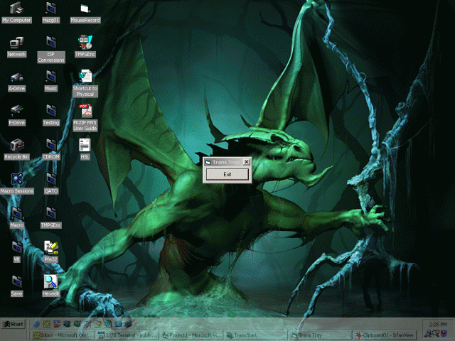

## Transparent Tray/Task Bar

### Description

Makes the System Tray, Task Bar and Start Button transparent. When mouse is over them, it will make them NOT transparent. Simple eh? I take no credit for the .bas file in the project. I took it from another project that makes any for transparent. This code was inspired by another submission a few days ago that was suppose to do the same thing, but the coder neglected to unclude the .bas that contained the functions needed for the program to work. So I made my own and here it is. You may steal, copy, delete or do whatever you want with this code, I don't mind.. Learn from it and enjoy it is all I care.. Note: may not work for older Operating Systems.
 
### More Info
 

             |
---                |---
**Submitted On**   |2002-08-29 14:23:02
**By**             |[¿?¿?](https://github.com/Planet-Source-Code/PSCIndex/blob/master/ByAuthor/empty.md)
**Level**          |Intermediate
**User Rating**    |3.4 (17 globes from 5 users)
**Compatibility**  |VB 6\.0
**Category**       |[Miscellaneous](https://github.com/Planet-Source-Code/PSCIndex/blob/master/ByCategory/miscellaneous__1-1.md)
**World**          |[Visual Basic](https://github.com/Planet-Source-Code/PSCIndex/blob/master/ByWorld/visual-basic.md)
**Archive File**   |[Transparen1242358292002\.zip](https://github.com/Planet-Source-Code/transparent-tray-task-bar__1-38463/archive/master.zip)

